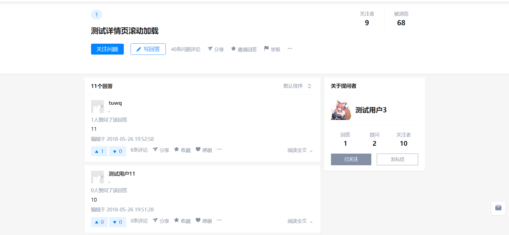

# 一个仿造PC端知乎的练习

> 技术栈采用less、vue、express、mongoose

> 主要功能: 问题、回答、评论的嵌套,赞踩问题回答、用户相互关注,用户动态列表 

> 代码冗余量大，未进行设计优化

## 启动方法

``` bash
# 添加npm包依赖
npm install

# mongodb测试数据位置
./mongo_data

# 进入server目录下serve运行app.js
cd server
node app.js

# 未设置图片服务器,打包后无法使用头像上传

# 开发环境下
npm run dev
node app.js

```

> 图片展示





For a detailed explanation on how things work, check out the [guide](http://vuejs-templates.github.io/webpack/) and [docs for vue-loader](http://vuejs.github.io/vue-loader).
